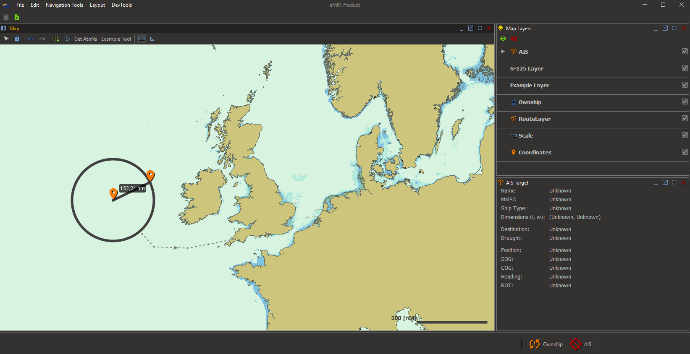

# eMIR Prototype Display (EPD)

The eMIR Prototype Display (in short: EPD, sometimes also referred to as e-Navigation Prototype Display) is a software 
platform for the development of maritime software solutions with a focus on an ECDIS-like UI. The EPD already contains 
many functionalities that are included in a productive ECDIS (map, AIS targets, route planning). However, the existing 
functionality can be extended by using the [Plug-In System](epd/doc/HowToUsePluginManager.md). With this it is also 
possible to cover other use-cases, such as traffic management or simulation.

The main view of the EPD consists of a Map-View and controls to overlay different feature/information-layers. 
Furthermore, in the standard configuration, the EPD supports distance measurements, coordinate transformation, 
bearing calculation and CPA-Calculation. It is also possible to display data from an NMEA0183-stream. For the 
chart data, it is currently possible to use Open Street Map with the OpenSeaMap extension, Google Maps, Google
Earth or a custom WMS-Server (e.g., to render S-57 or S-101 charts).

**_Disclaimer: Even though the EPD is an ECDIS-like software, that supports many of the typical ECDIS functionalities, it 
is not certified as an ECDIS and does not comply the IMO ECDIS performance standard. It is recommended to use it for
development and testing purposes only._**

## Instructions

### Build Instructions

The EPD is entirely written in Java with Maven as a dependency and build system. Instructions on how to
build this repository and how to export a standalone version can be found in [this README](epd/doc/HowToBuild.md).

### Resources

The following documents provide some guidance on how to start developing for the EPD.

* User Guides
  * [Using Plugin Manager](epd/doc/HowToUsePluginManager.md)
  * [Using Map View](epd/doc/HowToUseMap.md)
  * [Using Route Manager](epd/doc/HowToUseRouteManager.md)
  * [Display NMEA Data](epd/doc/HowToDisplayNMEAData.md)
* Plugin Development Guides
  * [Getting Started](epd/doc/GettingStarted.md)
  * [Documentation Guide](epd/doc/DocumentionGuide.md)

### Repository Structure
The following section gives a quick overview of the repository structure:
* **epd**:
    * EPD core plugins and additional modules
* **model**:
    * EPD data model including classes for vessels, geometries, ...
* **runtime**:
    * Core development code. This contains the metamodel for the data model classes, the eMIR Plugin Framework (epf)
      and plugin core code and plugin manager utilities.
* **services**:
    * Additional services and projects for plugin development (e.g. loading routes, AIS parser, ...).

## How to contribute
For the initial phase of this project we do not expect a high volume of contributions. Therefore, we just ask you to 
adhere to common coding practices and style guidelines. Pull-requests are welcome and contributors might be contacted 
individually to provide further details.

If you are interested in further collaboration in the area of maritime services / e-Navigation, please also check out 
the [Open Digital Incubator Initiative](https://digitalincubator.maritimeconnectivity.net/). EPD is also part of the 
[eMaritime Integrated Reference Platform (eMIR)](https://emaritime.de/) for the Verification and Validation (V&V) of 
highly automated systems. 

## Funding

**EfficientSea2**

This project has received funding from the European Union’s Horizon 2020 research and innovation programme under
grant agreement No 636329.

**STM Validation Project**

The authors would like to thank the STM Validation Project (2014-EU-TM-0206-S), the EU commission and co-funding 
agencies, Connecting Europe Facility/Motorways of the Sea, Västra Götalandregionen and VINNOVA for financial support.
