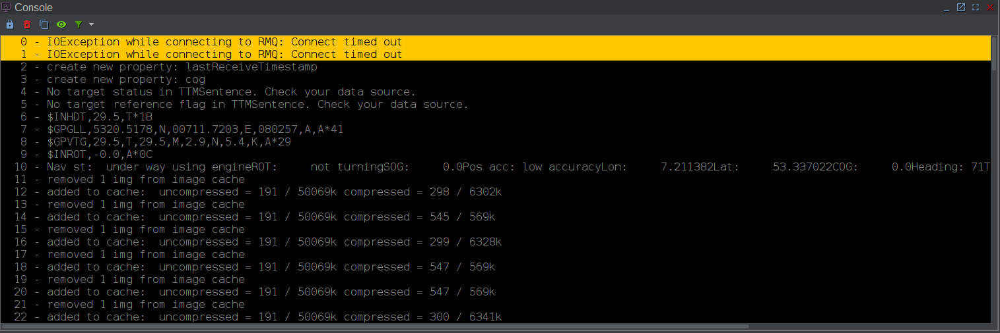
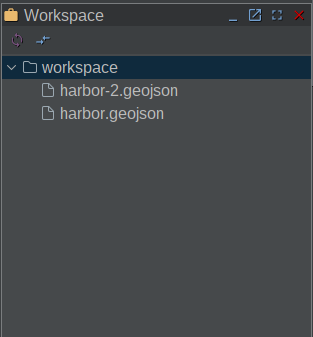
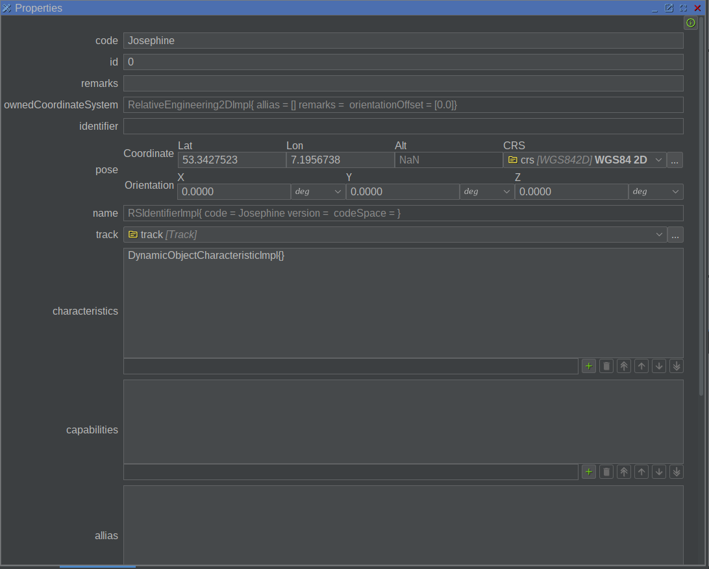
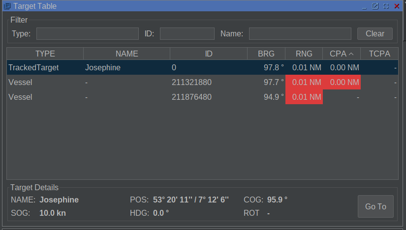

# General Views Plugin
The GeneralViews plugin provides several views used for displaying states of the model, 
file browsing and logging purposes. Currently, it offers the ConsoleView which allows visualization and
configuration of the logging system, the WorkspaceView which allows file browsing within the EPD
workspace, the OperationView and TargetTable which allows display of PhysicalObjects and calculations
on TCPA, CPA, Distance and Bearing to the currently configured Ownship.

## Provided Components

### Console View
The console view allows the visualization of log messages produced by the EPDs internal logging
framework as well as setting the log level for the application and its individual components
via the UI. 



### Workspace View
The workspace view is a file browser for the workspace folder
of the EPD and allows modifying these files with the builtin
text editor or eMOD editor. When exporting a product, this is generally the
place where all user defined files should be located in order to access them independent of
the host file system. The path of the workspace can be set in File>Settings>General>Workspace.
The path itself is either an absolute path on the host file system or can be set to a folder
relative to the product jar.




### Property View
The property view is a view which can extract UCore model information of properties. 
It is linked to the map view so that selecting an object on the map view itself triggers
an update to the property view. The view allows direct access to the UCore objects
contained inside a PhysicalObjects and visualizes the values of each object, such as the
current pose, coordinate reference system, name, characteristics etc. 




### Operation View
TBD

### Target Table View
The target table is a component capable of extracting data from the underlying EPD model and
displaying all PhysicalObjects and their current values. It also allows the display of Bearing, Distance, 
CPA and TCPA calculations from all targets to the currently configured ownship as well as
highlighting when one of these values exceed a configured threshold. The alerts, thresholds as well
as the general display of these calculations can be disabled in the settings at
File > Settings > General > Target Table



## Getting Started

### Prerequisites
The GeneralViews plugin is a core component of the EPDCommunity product. Therefore,
it is available in most default installations. However, if you want to install the plugin
manually, follow the following steps.

In order to install the plugin, the parent eMir-OpenSource project needs to be installed. This can be done by executing
following command:
```
    mvn clean install
```

### Installation

The GeneralViews plugin is either installed when executing ```mvn clean install``` on the parent eMir-OpenSource or can be installed
manually by executing the following command in this directory:
```
    mvn clean install
```

## Adding the Plugin

In order to add the plugin to the product, the DevelopmentTools plugin needs to be installed.
Afterwards, the PluginManager can be started by clicking DevTools > Configure Plugins in the EPD.
There, the pom.xml of the GeneralViews can be added to the list of plugins. After adding, click Apply & Exit and restart
the EPD. Afterwards, the GeneralViews should be enabled.


