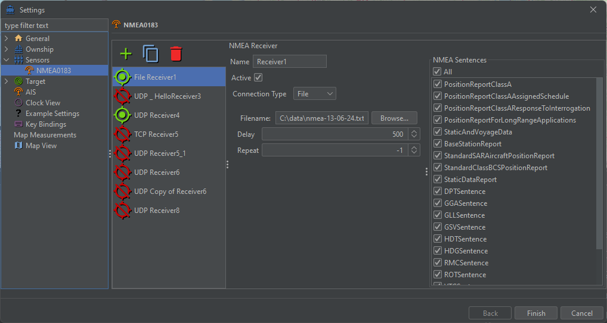
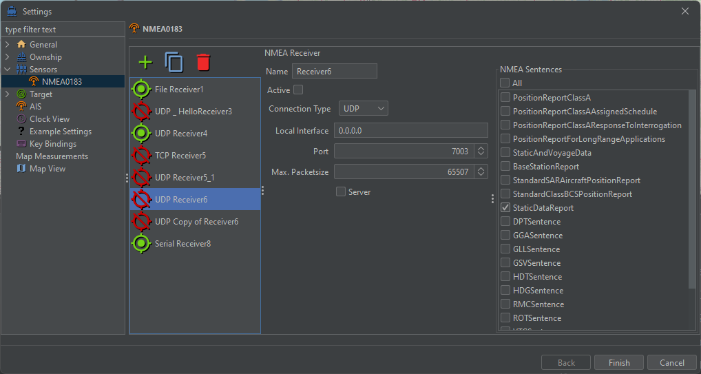
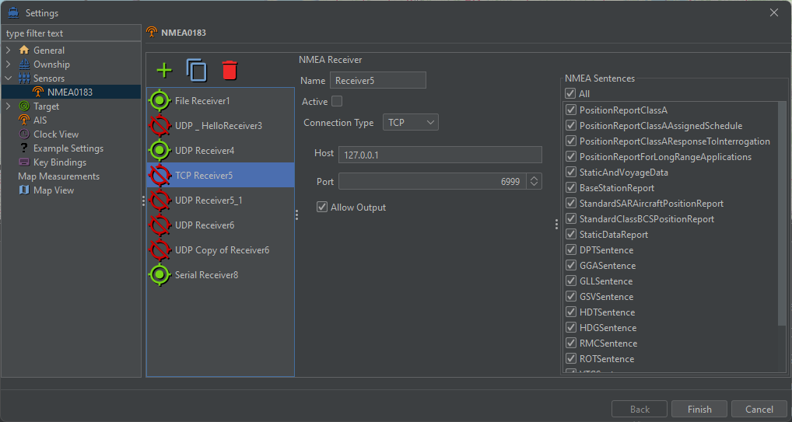
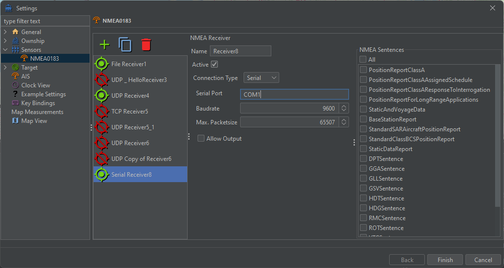

# SimpleNMEASensor
This is the simple NMEA sensor plugin for the EPD community edition. It uses the open-source [marine-api](https://github.com/ktuukkan/marine-api) to parse and decode NMEA0183 and AIS data.

## Setup
You can add, clone and remove sensor configurations using the toolbar. On the left you see the list of sensor configurations. By selecting items from this list you can change the parameters of the given sensor configuration.
The following recevier types are available for the NEMA sensors from the combobox "Connection Type":
 * UDP - Receive OR send data over a UDP connection as a client or server.
 * TCP - Receive AND/OR send data over a TCP connection as a client.
 * Serial - Receive AND/OR send data from a serial bus like COM1.
 * File - Read lines from a text file as input.
 
You can check individual items from the list of "NMEA Sentences" on the right or select the "all" checkbox to configure which sentence types should be handeled by this sensor.
Every sensor can have its own name.

### File parameters
 * Filename - select the input file containing lines of NMEA or AIS sentences.
 * Delay - the pause between read sentences in milliseconds.
 * Repeat - the number of repetetions to read this file (-1 means loop infinitely).
 

### UDP parameters
 * Local Interface - The local network interface to use for the UDP connection (Default is 0.0.0.0).
 * Port - The UDP port to connect to.
 * Max. Packetsize - Allow no more than this number of bytes per package (Default is 65507).
 * Server - If the connection acts as server AIS sentences can be sent to clients.
 

### TCP parameters
 * Host - The remote TCP host to connect to.
 * Port - The TCP port to connect to.
 * Allow Output - Connection can be used to send AIS sentences.
 

### Serial parameters
 * Serial Port - Connect to this serial bus.
 * Baudrate - The speed of this serial connection.
 * Max. Packetsize - Allow no more than this number of bytes per package (Default is 65507).
 * Allow Output - Connection can be used to send AIS sentences.
 

