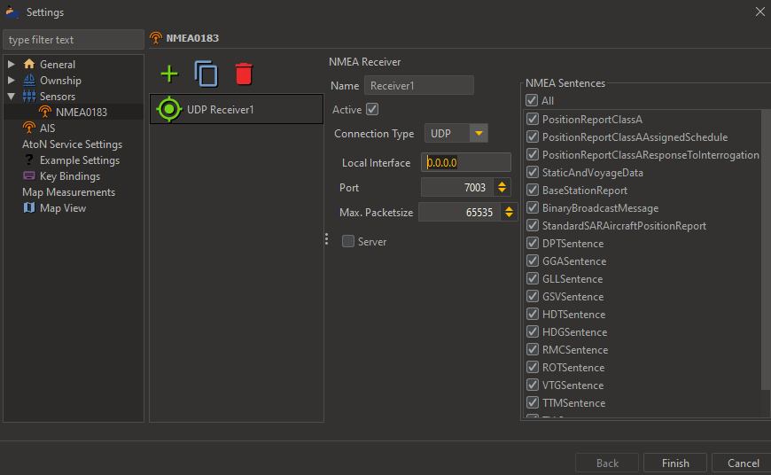

## Displaying NMEA-Data
Using the NMEASensor Plugin it is possible to display live NMEA0183 data in the EPD (and also to process 
user-interaction with the displayed object). The EPD provides four possibilities to read a NMEA0183 data:

* Via UDP
* Via TCP
* Via File (for recorded data, that is played back)
* Via a Serial Port

The data stream can be configured at **File -> Settings -> Sensors -> NMEA0183**:

Clicking on the '+' icon creates a new "sensor" that imports the data stream. It is possible to connect multiple
different data sources at the same time. You can configure further display options for AIS in the "AIS" section of the
settings page. It is also possible to set a MMSI under the "`Ownship -> AIS Information`" section. In this case, the EPD
checks all messages for the configured MMSI and renders messages that originate from that MMSI as own ship data.

### Display AIS Sample Data

For testing purposes, an AIS sample file is provided alongside the EPD. This can be imported via file-stream and played 
back by the EPD. To do this, perform the following steps:

1. Open NMEA plugin settings-page
   - `File -> Settings -> Sensors -> NMEA0183`
2. Add a new Receiver (`+` sign)
3. Configure Receiver
    - Check active checkbox 
    - Choose connection type: `File`
    - Choose Sample File (e.g. `epd/doc/data/ais_sample.txt`)
    - Set Delay: `1000`
    - Set Repeat: `-1`
    - Under "NMEA Sentences" select `All`
4. Click "Finish" on the bottom right

If everything has been configured correctly, a ship at the Elbe river entry in germany is shown. It will sail through 
the Elbe in direction Hamburg. 

### Simulating Ownships via AIS

In many cases an ownship is needed for testing without an AIS receiver which transmits AIVDO messages. The EPD offers 
the possibility to select a ship as an own ship by its MMSI. Firstly, [configure an NMEA receiver to receive 
AIS data](#display-ais-sample-data). Then open the settings-page and select `Ownship`. Then select `AIS Target by MMSI`
and type in the MMSI of a vessel. For the sample data provided by the EPD choose `247082500`. After this, the view
`Ownship info` should display the vessel information. Also, a marker will be displayed on the corresponding vessel.
