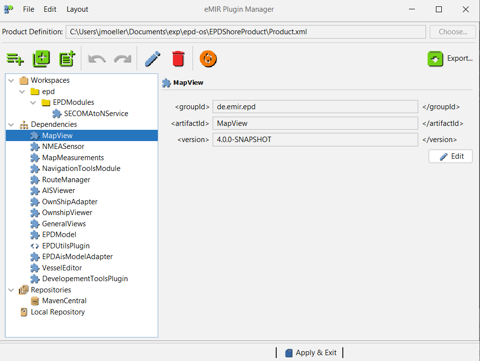

## Plug-In System
The EPD utilizes a Plug-In system to dynamically load Plug-Ins at startup time. All of the core functionalities 
are implemented as Plug-Ins and can be configured via the Plug-In manager or via config files. 

### Plug-In manager UI

The Plug-In manager may be part of a standalone EPD version, if the Plug-In manager project is added as a 
dependency. Then is can be opened using the main menu bar(**DevTools -> Configure Plugins**).



There are three different ways how Plug-Ins can be loaded via the Plug-In manager:
* **Dependencies**: Dependencies are Plug-Ins that are loaded as maven dependencies from a local or remote
  repository (see repositories).
* **Workspaces**: For development purposes it is also possible to import a single build of a Plug-In. To do that you
  have to link to the Maven-Project (specifically the pom.xml) of your Plug-In.
* **Repositories**: A repository is a Maven repository where binaries (JAR-files) are stored.

For adding new plugins click on "Add Plugin(s)" (first of the three green icons). In the new window, select "Browse" 
and select the pom.xml of your Plug-In. Tick the box in front of your Plug-In and click "Apply". After restarting the 
EPD, your Plug-In will be loaded automatically.

### Plug-In manager config file

The configuration file for a EPD is generated on first start of the program. The Plug-In manager will check if 
the corresponding product folder `~/<Productname>` is already present and will create one otherwise. Then it
will create a `Product.xml` file inside it, which contains the plugin configuration. For the EPD Community Product
the path would be `<home>/EPDCommunity/Product.xml`.
This file is read by the Plug-In system. The scheme is based on that of a `pom.xml`. Three elements can be defined
here 1) `workspaces`, 2)`dependencies`, 3) `repositories`. The following code section shows a minimal `Product.xml`.
```xml
<project>
	<!-- This is NOT a MAVEN file it just uses a similar syntax -->

	<name>EPD</name>
	<description>EPD Example Configuration</description>
	<version>0.0.1-SNAPSHOT</version>
	<localRepos>/home/user/.m2/repository</localRepos>

	<workspaces>
	    <workspace>/home/user/epd/EPDModules/ExampleProject/pom.xml</workspace>
	</workspaces>

	<dependencies>
		<dependency>
			<groupId>de.emir.epd</groupId>
			<artifactId>MapView</artifactId>
			<version>4.2.0-SNAPSHOT</version>
		</dependency>
	</dependencies>

	<repositories>
		<repository>
          <!-- The id must match the ending of the maven-metadata.xml, i.e. central for maven-metadata-central.xml in the local repository folder -->
			<id>central</id>
			<url>http://repo1.maven.org/maven2/</url>
			<username></username>
			<password></password>
		</repository>
		<repository>
			<id>Athou</id>
			<url>https://github.com/Athou/maven-repository/raw/master/repo</url>
			<username></username>
			<password></password>
		</repository>
		<repository>
			<id>jcenter</id>
			<url>http://jcenter.bintray.com</url>
			<username></username>
			<password></password>
		</repository>
	</repositories>

</project>
```

`workspaces` are intended for developers who are currently implementing a plugin. The pom of a project is entered here.
If the EPD is started, the plugin is loaded via the locally compiled file instead of the plugin being obtained via the
Maven repository (see `localRepos`). Dependencies are defined like dependencies in Maven projects. That is via the
`groupId`, `artifactID` and `version`. If the artifact is not found in the local repository, it is automatically loaded
from a repository. A repository is just a Maven repository where JARs are stored. Finally, repositories are defined within
the product definition following the schema of Maven files. 
