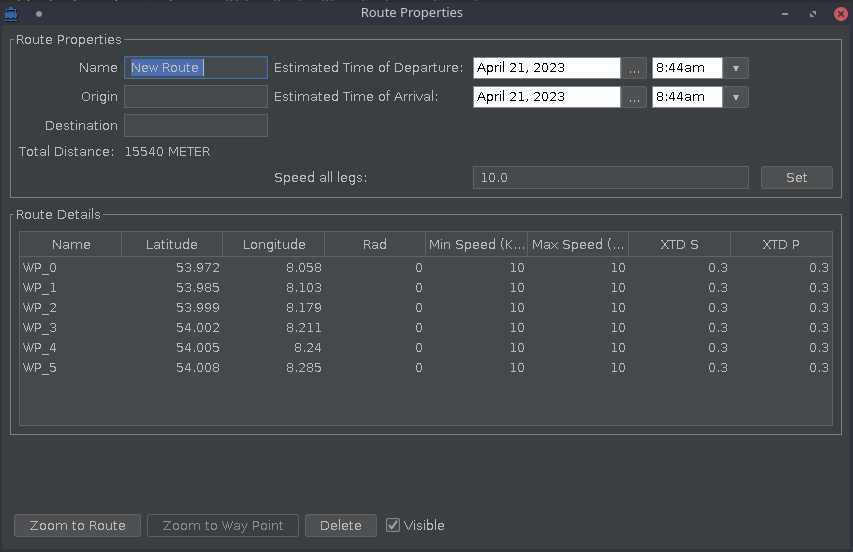

## Route Manager

The route manager manages all routes that are stored in the EPD model. This includes, for example, routes that are 
assigned to a ship (e.g. own ship) or any that have been created and planned, but are not assigned to an object. The 
route manager can be used via the `Routes` view. This looks like this, for example:

The route manager divides routes into groups. The `Unassigned` group contains all routes that are not assigned to an 
object. Routes that are assigned to a vessel will be in the respective vessel group (e.g. `Vessel 211321880`). For each 
route or group you can decide if it should be visible on the map or not. Routes can be imported or exported via the 
toolbar on the right side. The EPD supports common formats like `RTZ - Route Plan Exchange Format`. Individual 
attributes can be edited via the `Properties` view.

### Plan a new route 

A new route is created using the `New Route Tool` on the top toolbar. Once activated click on the map to add new
waypoints to your route. To finish the route creation, press `ESC` or activate another tool on the maps' toolbar. The
route is now shown in the `Routes` view in the `Unassigned` group. It can now be edited to set speed and cross track
errors. Cross track errors are shown as semi transparent areas around the route. Routes can also be edited using the
`Edit Route Tool` on the maps` toolbar. Once activated waypoints can be moved on any route. New waypoints can be added
by clicking on the line between two waypoints. The result may look like this:

Route editing and planning is supported by the navigation tools. It provided tools to measure distances and angles
which may be used to plan routes more precisely. This is shown on the image with the `distance tool` to measure
the distance to cardinal buoys in the german bight. 
